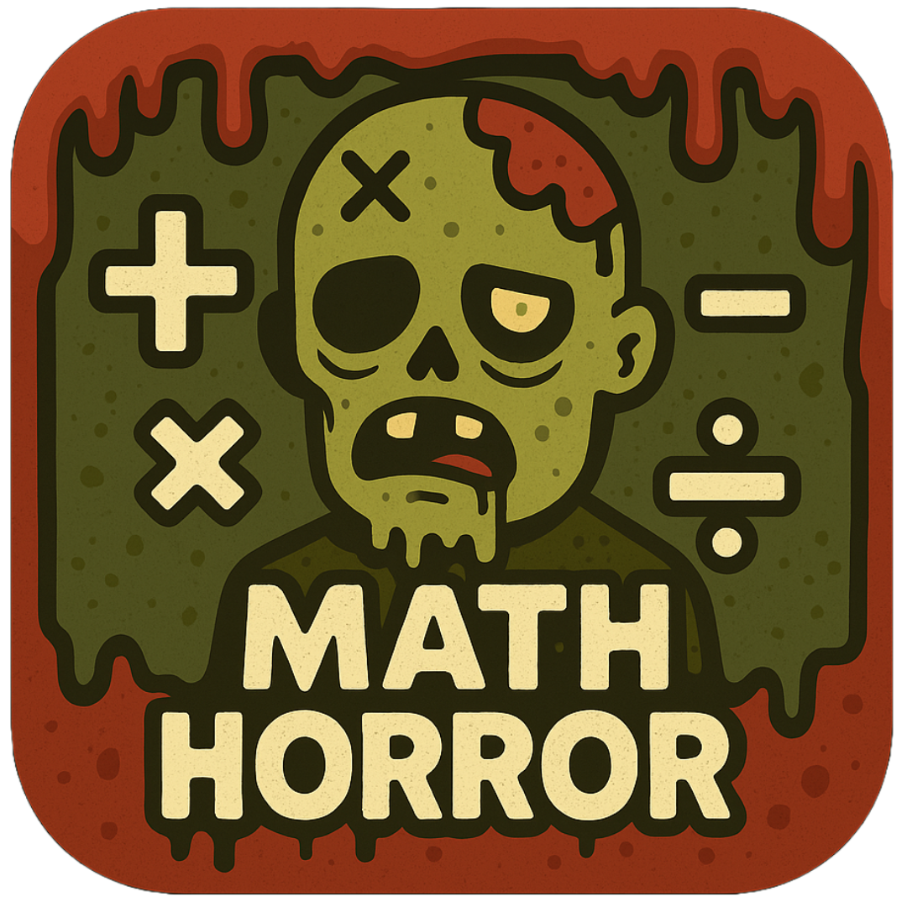

# Math Horror



A spooky math learning game that challenges players with increasingly difficult math problems across multiple difficulty levels. Face your math fears and improve your skills while racing against the clock!

## Features

- **Six Difficulty Levels**: From basic arithmetic to complex algebra
- **Multilingual Support**: Available in English, Finnish, and Greek
- **Immersive Sound Effects**: Spooky audio enhances the gaming experience
- **High Score System**: Track your progress and compete with yourself
- **Lives System**: Multiple chances to solve problems
- **Streak Rewards**: Earn extra lives by answering consecutive questions correctly
- **Responsive Design**: Play on desktop or mobile devices

## Game Mechanics

- **Questions**: Each level presents a series of math questions appropriate to the difficulty
- **Timer**: Answer questions before time runs out
- **Lives**: Start with 3 lives, lose one for incorrect answers or timeouts
- **Scoring**: Earn points based on how quickly you answer correctly
- **Life Bonus**: Remaining lives add bonus points to your final score (111 points per life)
- **Streaks**: Get 10 correct answers in a row to earn an extra life

## Technology Stack

- **Frontend**: React with TypeScript
- **State Management**: React Context API
- **Styling**: SCSS with responsive design
- **Internationalization**: i18next for multilingual support
- **Sound**: Howler.js for audio management

## Getting Started

### Prerequisites

- Node.js (v14 or higher)
- npm or yarn

### Installation

1. Clone the repository:
   ```
   git clone https://github.com/jahonen/math-horror.git
   cd math-horror
   ```

2. Install dependencies:
   ```
   npm install
   ```

3. Start the development server:
   ```
   npm start
   ```

4. Open [http://localhost:3000](http://localhost:3000) to play the game

## Building for Production

```
npm run build
```

This creates an optimized production build in the `build` folder.

## Project Structure

- `/public` - Static assets and localization files
- `/src` - Source code
  - `/assets` - Images and other static resources
  - `/components` - Reusable React components
  - `/contexts` - React context providers (Game and Sound)
  - `/locales` - Translation files (en, fi, el)
  - `/pages` - Main screen components
  - `/services` - Question generation and game logic
  - `/styles` - SCSS stylesheets
  - `/types` - TypeScript type definitions

## Internationalization

The game supports three languages:
- English (default)
- Finnish
- Greek

Language files are located in `/src/locales/[language-code]/`.

## Contributing

Contributions are welcome! Please feel free to submit a Pull Request.

## License

This project is licensed under the MIT License - see the LICENSE file for details.

## Acknowledgments

- Sound effects from [source]
- Inspiration from classic educational games
- Special thanks to all math teachers who make learning fun!
